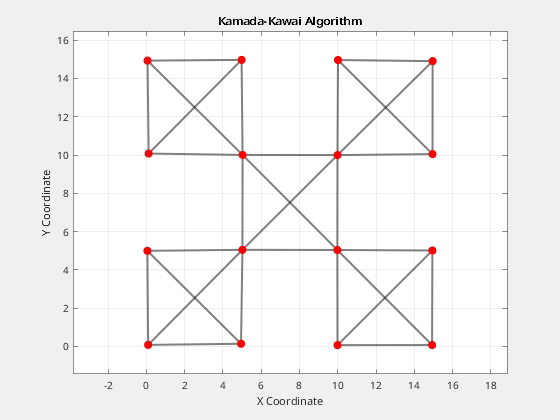
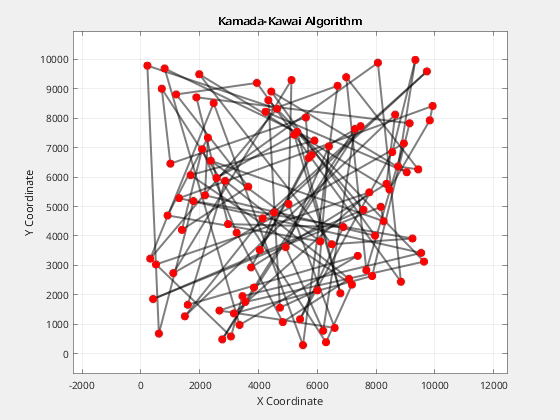

# ParallelNP

## Opis
Namen projekta je med seboj **primerjati** različne pristope vzporednega reševanja [problemov](./docs/PROBLEMS.md) z **različnimi programskimi jeziki** - **c, go, julia**.\
Programje na GitHub-u služi le reševanju teh problemov z naštetimi jeziki.

## Uporaba Programja
Za zaganjanje programja, je najprej potrebno [namestiti zahtevano programsko opremo](./docs/SETUP.md). \
Programje v celoti lahko uprabljamo z ukazi `make`, kar je naknadno opisano v [dokumentaciji](./docs/USAGE.md).\
Dodatna razlaga o delovanju programja je na voljo v [dokumentaciji](./docs/EXPLAIN.md).

## Primer Izvajanja
*Rezultati izvajanja za **Partition Problem**:*

*Rezultati izvajanja za **Kamada Kawai algoritem**:*

Algoritem z zmagovalnim časom je označen z rumeno barvo, algoritem z najslabšim časom pa s svetlo rdečo.
Časovno ugodnejše rešitve so označene z zeleno barvo, medtem ko so časovno manj ugodne rešitve označene z rdečo barvo.
V primeru, da rešitev ni pravilna, je to označeno s svetlo vijolično barvo.

Za Kamada-Kawai algoritem se generirajo tudi `avi` datoteke, ki prikazujejo premikanje delcev:

\

## Vprašanja
Ne znam se odločiti, ali je bolje da pri Partition Problemu delam result boolean array skupen vsem algoritmom ali ga naredim znotraj vsakega algoritma posebej.\
Ali lahko probleme za boljše rešitve objavim na Reddit?\
Zakaj je julia mlt_dyn hitrejši od seq v primeru 02.json?\