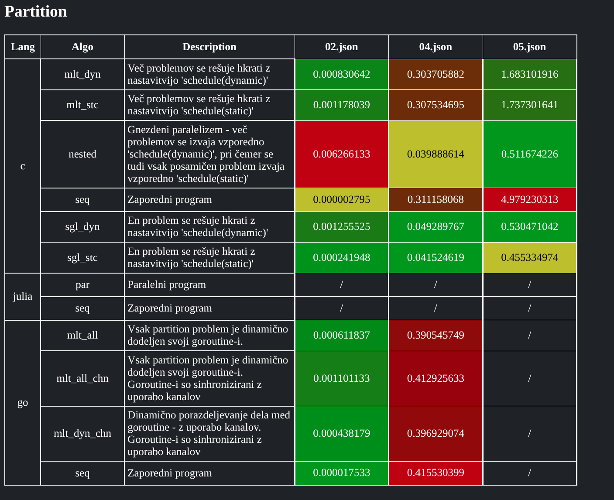

# ParallelNP

## Opis
Namen projekta je med seboj **primerjati** različne pristope vzporednega reševanja [NP-polnih problemov](./docs/PROBLEMS.md) z **različnimi programskimi jeziki** (c, go, julia).\
Programje služi reševanju NP-polnih problemov z naštetimi jeziki.\
Programje v celoti lahko uprabljamo z ukazi `make`, kar je naknadno opisano v [dokumentaciji](./docs/USAGE.md).

## Namestitev
Za zaganjanje programja, je najprej potrebno [namestiti zahtevano programsko opremo](./docs/SETUP.md). \
Dodatna razlaga o delovanju programja je na voljo v [dokumentaciji](./docs/EXPLAIN.md).

## Primer Izvajanja
Spodnja tabela prikazuje rezultate izvajanja algoritmov za reševanje problema **Partition**.\
Časovno ugodnejše rešitve so označene z zeleno barvo, medtem ko so časovno manj ugodne rešitve označene z rdečo barvo.

Spodnja tabela prikazuje rezultate izvajanja algoritmov za reševanje problema **Kamada Kawai**.\
V primeru, da rešitev ni pravilna, je to označeno s svetlo vijolično barvo.

## Vprašanja
Časovno merjenje - po threadih ali stenski uri?