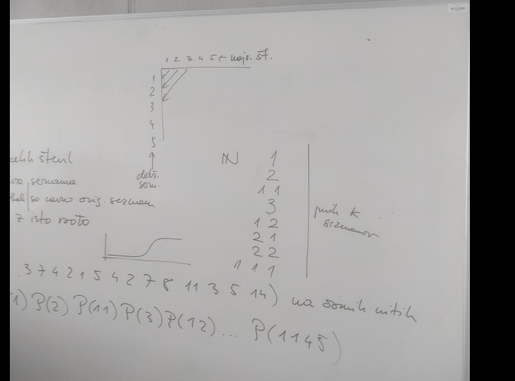

# Kronološki zapsiki ob izdelavi diplomske naloge

12.02.2024
---
Po izpitu OUI (~13:00) sem šel v profesorjev kabinet. Omenil sem mu področja, ki me zanimajo. Profesor mi je podal par vprašanj v razmislek v povezavi s temo in naravo dela za diplomsko nalogo. Sam nisem imel nobene zamisli za specifični projekt, zato sem ga prosil, da mi priskrbi kakšno temo za diplomsko delo.

19.02.2024
---
Po predavanjih prevajalnikov (~17:00) sem se sestal s profesorjem glede teme. Profesor mi je pokazal osnovno o Julia programskem jeziku.

21.02.2024
---
Sestanek je bil v učinlici po vajah prevajalnikov (~09:00). Profesor mi je priskrbel temo. Zmenila sva se, da bi lahko primerajal vzporedno programiranje v različnih programskih jezikih na enakih problemih.  
Kandidati za jezike:
```
Go
c
C++
Julia
```
Kandidati za probleme:
```
NP-poln problem (partitioning problem)
Problem iz teorije grafov
HashTable problem ?
```
26.02.2024
---
Srečanje s profesorjem po predavanjih prevajalnikov. Obnovila sva, kar sva bila že zmenjena. Dokončno sva dorekla, da bodo problemi iz teorije grafov. Do prihodnjihkrat bova oba našla probleme na tem področju.

13.3.2024 Sestanek po vajah za prevajalnike 11:30 - 12:15
---
#   
S profesorjem sva našla tri algoritme iz teorije grafov, na katerih bom testiral vzporedno programiranje v treh različnih jezikih.

- 1. NP problem: "Partitioning problem" - velika množica
- 2. NP problem: "Partitioning problem" - veliko malih množic, ki jih generiramo s postopkom, ponazorjenem na sliki (graf na sredini zgoraj na [sliki](#slika))
- 3. Imena tretjega algoritma se nisva spomnila. Gre za algoritem, kjer imamo podan graf G<V,E>, pri čemer se vsako vozlišče z vsakim med seboj odbija (odbojna sila), le da se tisti, ki so med seboj povezani med seboj privlačijo (se držijo skupaj)

Do naslednjič si pogledam te algoritme in poskusim katerega izmed njih imlementirati.

Pri prvih dveh problemih bom rešitev poskusil implementirati rekurzivno kot tudi iterativno, da opazujemo kakšno "performance" ceno ima klic funkcije (preklapalanje med nitmi - menjava konteksta in podobno).

03.04.2024 Sestanek po vajah za prevajalnike 11:10 - 11:40
---
Pogovor sva začela s problemom, ki sva ga prejšnjikrat obdelala nekoliko manj podrobno - to je tretji problem oziroma problem simuliranja premikanja delcev, ki drug drugega bodisi privlačijo in odbijajo.
Podrobnejši opis implementacije:

- Vozlišča problema bomo generirali naključno. Za generiranje vozlišč lahko načeloma uporabimo psevdonaključne algoritme, vendar bi bilo dobro, da pazim, da niti, ki uporabljajo enak algoritem za naključne koordinate (si ga delijo) prejmejo različna (dejansko naključna) števila.
- Zelo dobro bi bilo prikazati začetno in končno stanje grafa s sliko, zaporedjem slik (začetno in končno stanje) ali pa gifom. To je moč narediti v katerem koli jeziku (octave, Matlab ipd. je popolnoma vseeno kako to naredim). Že za sam prikaz uspešnosti rešitve in bolše tolmačenje pa je skoraj nujen ta prikaz.
- Ker lahko pride do tega, da se pred končnim stanjem delci gibljejo sem in tja (skačejo) v ciklu, je v algoritem pametno vključiti simulirano ohlajanje, ki z vsako iteracijo manjša sile, s katerimi delci delujejo drug na drugega. 
- V kolikor ne bo pretežko, enačbe algoritma predrugačimo tako, da bo delovalo v tridimenzionalnem prostoru, **vendar najprej implementiramo v dvodimenzionalnem prostoru**
- Korak pri izvajanju algoritma naj bo dolg (časovno), kolikor je velikost rezultante sil, ki delujejo na ta delec. Torej, ne simuliramo delvanje sil na časovno enoto, pač pa diskretno glede na seštevek sil v podanem koraku.


Za vse tri rešitve je predlagal, naj najprej implementiramo zaporedni program, tako da bomo problem razumeli in šele nato nadaljujem na vzporedne rešitve.  
Implementacija vseh treh rešitev naj omogoča, da bo uporabnik izvajal program s poljuno veliko (s parametri določeno) številom niti (**strojnih!**).  
Na STUDISU moram izpolniti obrazec za prijavo diplomske naloge, kjer označim mentorja in napišem (nekončen) naslov diplomske naloge. Ta naslov lahko spreminjava vse do prijave teme oziroma zagovora (tam nekje). Prijaviti moram do 15.4.2024. Opis naloge bo tudi spisal on: kakor sem razumel v angleščini in slovenščini - kakor vem je to tistij nekaj vrstic, ki se prikaže na spletni strani FRI-ja. Točnega naslova, ki ga je omenil se ne spomnim, nekaj v smislu: "Primerjava vzporedenja problemov v C, Julia in Golang." V bistvu niti približno tako, vem le, da je bilo o primerjavi in vzporedenju, nekaj tudi o jedrih.
